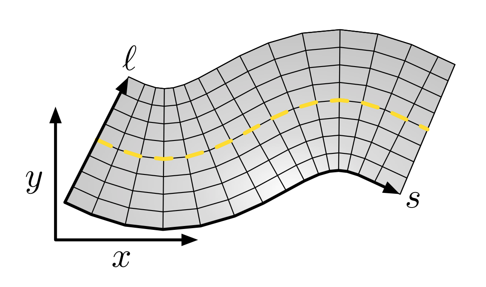
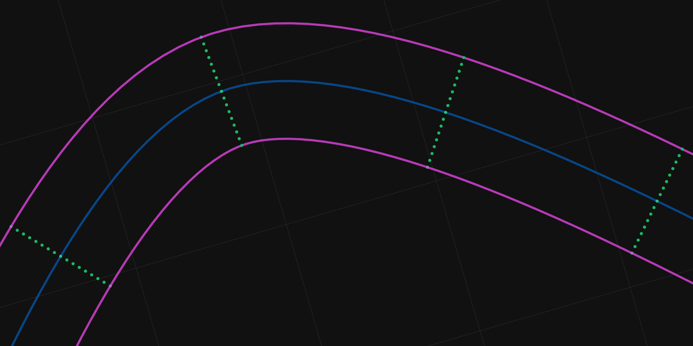
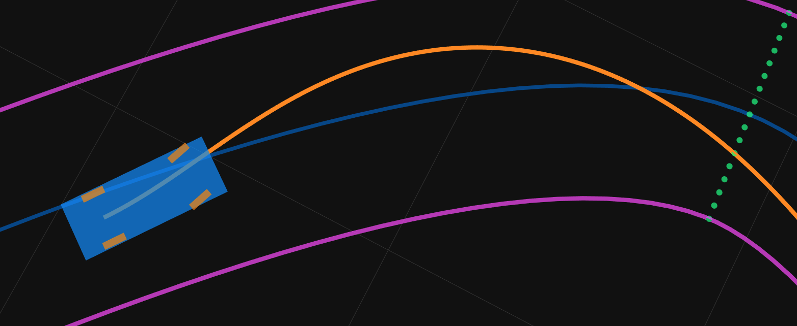
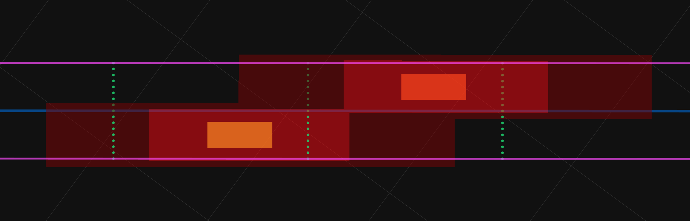
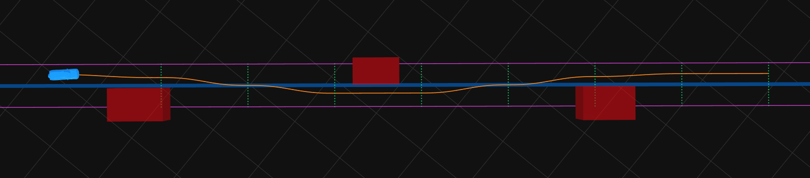

# AI 自动驾驶汽车模拟器

基于WebGL和Three.js构建的实时运动规划器和自动驾驶汽车模拟器。


这个项目展示了在浏览器中实现实时、基于道路格子的自动驾驶汽车运动规划器。许多自动驾驶汽车的运动规划器都是在C或C++中实现的，或者利用CUDA或OpenCL等计算平台在GPU上高度并行地生成规划。通过WebGL，我们可以在浏览器中实现类似的并行规划算法，这些算法可以在各种中等性能的消费级显卡上运行。借助Three.js，可以在实时3D模拟场景中执行运动规划器。

这个模拟器仍在开发中。您可能会遇到错误、WebGL崩溃、奇怪的车辆行为以及其他各种故障。目前，它只能在启用了[硬件加速](#enable-hardware-acceleration)和[实验性画布功能](#enable-experimental-canvas-features)的[Google Chrome](https://www.google.com/chrome/)中运行。目标帧率为60fps，但它可能运行得更慢，具体取决于您的硬件上规划所需的时间。

## 工作原理

这个运动规划器主要基于两篇关于并行基于格子的轨迹规划的博士论文：Matthew McNaughton的《实时运动规划的并行算法》和王水英的《自动驾驶汽车的基于状态格子的运动规划》。

### SL坐标系和格子

模拟和车辆在标准的XY笛卡尔坐标系中运行。然而，对于某些组件，使用受道路形状影响的坐标系更容易。在适当的情况下，规划器使用站-纬度(SL)坐标系。站是从某个初始点沿道路的纵向距离，纬度是相对于中心线的横向偏移（负纬度在左侧，正纬度在右侧）。



使用SL坐标系，沿着从车辆当前位置开始的道路，在某个空间范围距离内构建一个具有等间距点的格子。每个格子点都有一个SL位置、一个航向和一个曲率，这些都完全由道路形状定义。格子点及其连接的边形成一个轨迹图；运动规划器根据由各种项组成的成本函数返回通过该图的最佳路径。



### 多项式螺旋路径

为了实现平稳驾驶，运动规划器返回的任何路径都必须保证连续曲率（意味着方向盘不会不连续旋转）；显然，直线边不能用于连接站点之间的格子点。多项式螺旋是一种曲率是其弧长多项式函数的曲线；它为规划器提供了连续曲率路径，并且可以使用梯度下降快速估算其系数。按照某种连接模式创建格子点之间的边，并使用WebGL着色器并行优化每条边的多项式螺旋系数。还创建多项式螺旋边来连接车辆的当前位置到格子上的点。



### 障碍物

运动规划器会避开静态和动态障碍物。在模拟过程中，静态障碍物被认为是静止的，动态障碍物的未来位置是根据其速度和当前位置计算的。使用WebGL将障碍物绘制到障碍物成本网格上，动态障碍物成本网格具有多个代表不同时间范围的"帧"。为了确保在障碍物周围安全移动，网格上的障碍物尺寸会被膨胀成两个区域：较小的碰撞区域和较大的危险区域。穿过碰撞区域的路径成本为无限大，并在图搜索中被修剪。穿过危险区域的路径成本增加，但仍然可行。此外，纵向方向的膨胀尺寸比横向方向大。这允许车辆与障碍物具有较小的纬度距离但较大的站距离（即，在高速公路上与相邻车道的车辆保持几英尺的距离是安全的，但在高速公路上跟在车辆后面几英尺是不安全的）。



### 图搜索

每个二维站-纬度格子点都被增强为一个图顶点，增加三个维度：时间范围、速度范围和恒定加速度剖面。由于搜索是在动态环境中进行的，因此时间维度和速度维度被添加到图顶点中。然而，为了避免搜索空间大小的指数级增长，规划范围的估计时间和速度极值被离散化为几个范围。在所有终止于特定时间范围和速度范围的顶点的传入边中，只保留最佳轨迹。尽管这可能会丢弃图中的最优路径，但落入相同范围的边实际上是等效的，因此发现的路径应该只是略微次优。

每个图顶点还有一个相应的加速度剖面维度，它决定了在传入轨迹长度上发生的速度变化。使用了几种加速度剖面，例如恒定的硬加速/制动和软加速/制动，以及计算出的加速度以达到目标速度，如配置的速度限制或完全停止。



#### 成本函数

连接两个图顶点的每条轨迹边都有一个相关的遍历成本。通过将多项式螺旋路径采样为不同的点（比如每0.5米）并汇总每个点的成本项来计算此成本。使用各种成本项来惩罚以下情况：接近静态或动态障碍物、相对于车道中心的横向偏移、在非首选车道上行驶、超过速度限制、加速或制动过猛、高横向加速度等。

#### 动态规划

假设车辆只会沿着道路向前行驶，这意味着其站是单调递增的。基于这个假设，确定在某个站结束的路径的总成本只需要事先计算前几个站的成本（成本不依赖于后面的站）。这种最优子结构特性允许我们使用动态规划来计算通过图的最佳路径。图搜索从第一个站的顶点开始，向前迭代，使用在前几个站找到的最优路径来扩展解决方案，直到达到空间范围的末端。

### WebGL和着色器

WebGL 2基于OpenGL ES 3.0（为智能手机和平板电脑等嵌入式系统设计的简化版OpenGL）。它只提供顶点着色器和片段着色器，没有几何着色器或计算着色器或并行编程框架。在这样的约束条件下实现最初为CUDA设计的算法肯定很困难。例如，在原始文献中，图搜索算法使用成本表来存储到目前为止为图中每个特定顶点找到的最佳轨迹（及其成本）。当从顶点扩展轨迹时，结果顶点（包括基于初始时间和速度以及所选加速度剖面而落入的任何时间范围和速度范围）如果其成本较低，则会原子性地用新轨迹更新其成本表条目。这种技术在WebGL的GLSL着色器中是不可能的。着色器线程无法访问可以传输回CPU的共享可变内存。在WebGL中并行计算的唯一方法是让片段着色器中的每个片段计算自己的工作项。为了在GLSL中实现动态规划图搜索，帧缓冲区中的每个像素都被分配给当前正在处理的站的一个顶点。它找到终止于该顶点的最佳轨迹，并返回其颜色数据，包括（1）总成本，（2）最终时间，（3）最终速度，和（4）前一个顶点。然后将此颜色数据作为纹理返回给CPU，解包并处理以重建通过图的最小成本路径。

运动规划器的几乎所有部分都是用GLSL实现的；您可以在[`gpgpu-programs`](./js/autonomy/path-planning/gpgpu-programs)目录中找到用于规划器每个组件的着色器；

## 浏览器支持

Dash目前完全支持[Google Chrome](https://www.google.com/chrome/)。Chrome是唯一支持在Web Worker创建的OffscreenCanvas中使用WebGL 2的浏览器。规划器必须在单独的线程中运行（使用Web Worker），这样读取规划结果回CPU就不会阻塞模拟。

### Google Chrome

必须启用硬件加速和实验性画布功能。Dash在Windows和MacOS上的Google Chrome中都能正常工作。Linux尚未经过测试，但我没有看到任何迹象表明它不能工作。Chromium也可能工作。

#### 启用硬件加速

您可以在设置->高级->系统中启用硬件加速，或者访问：
```
chrome://settings/?search=hardware+acceleration
```

#### 启用实验性画布功能

必须启用实验性画布功能才能使用OffscreenCanvas。通过访问以下地址启用它：
```
chrome://flags/#enable-experimental-canvas-features
```

如果您能在[这个Three.js示例](https://rawgit.com/mrdoob/three.js/dev/examples/webgl_worker_offscreencanvas.html)中看到旋转的木箱，那么所有正确的设置都应该已启用，Dash可以完全正常运行。

### Firefox

可以通过在`about:config`中设置`gfx.offscreencanvas.enabled`标志在Firefox中启用OffscreenCanvas。

然而，即使OffscreenCanvas可用，Dash在Windows的Firefox Quantum中也无法工作。似乎OffscreenCanvas在Web Workers中不受支持，运行规划器会导致标签页崩溃。有关更多信息，请参见[这个Firefox工单](https://bugzilla.mozilla.org/show_bug.cgi?id=1436036)。

Dash在MacOS的Firefox Quantum中确实可以工作。但与Chrome相比帧率很低，模拟几乎无法运行。

### Edge

模拟在Microsoft Edge中大部分是损坏的。它目前不支持WebGL 2或OffscreenCanvas。

### Safari

在MacOS High Sierra (10.13.3)上测试了Safari 11.0.3，但该版本对不支持WebGL。Safari Technology Preview支持WebGL；但它不支持OffscreenCanvas，所以运动规划器不起作用。

### 移动浏览器

我没能成功在移动浏览器上运行规划器。移动设备上的嵌入式GPU可能太弱，无法以合理的频率运行规划器。

## 开发

Dash设计为在`file://`协议上完全离线运行，无需本地服务器来提供资源。但是，如果进行了任何更改，Webpack会用于将源代码重新构建为单独的应用程序和工作程序分发。开发依赖项通过[npm](https://www.npmjs.com/get-npm)下载。

进行更改后，使用以下命令构建项目：
```
npm run build
```

## 许可证

Dash在MIT许可证下授权。您可以在[这里](https://github.com/weyumm/AI_DashAuto_Game/blob/master/LICENSE)找到完整的许可证文本。


# [AI-Driven Self-Driving Car Simulator](https://weyumm.github.io/AI_DashAuto_Game)

Real-time motion planner and autonomous vehicle simulator in the browser, built with WebGL and Three.js.


This project demonstrates a real-time, on-road, lattice-based autonomous vehicle motion planner in the browser. Many autonomous vehicle motion planners are implemented close to the metal in C or C++, or they utilize computing platforms like CUDA or OpenCL to generate plans in a highly parallel fashion on the GPU. Using WebGL, we can implement similar parallel planning algorithms right in the browser that can run on a variety of moderately-powerful consumer graphics cards. With Three.js, the motion planner can be executed in real-time 3D simulated scenarios.

This simulator is still a work-in-progress. You may see bugs, WebGL crashes, strange vehicle behavior, and any number of other failures. Currently, it is functional only in [Google Chrome](https://www.google.com/chrome/) with [hardware acceleration enabled](#enable-hardware-acceleration) and [experimental canvas features enabled](#enable-experimental-canvas-features). The target frame rate is 60fps, but it may run slower depending on how long planning takes on your hardware.

## How It Works

This motion planner is mainly based on two Ph.D. theses on parallel lattice-based trajectory planning: _Parallel Algorithms for
Real-time Motion Planning_ by Matthew McNaughton and _State Lattice-based Motion Planning for
Autonomous On-Road Driving_ by Shuiying Wang.

### SL Coordinates and the Lattice

The simulation and the vehicle run in a standard XY Cartesian coordinate system. However, for certain components, it is easier to work with a coordinate system that is influenced by the shape of the road. Where appropriate, the planner instead uses a station-latitude (SL) coordinate system. The station is the longitudinal distance along the road from some initial point, and the latitude is the lateral offset from the centerline (with negative latitudes to the left and positive latitudes to the right).


Using the SL coordinate system, a lattice is built with equally-spaced points for some spatial horizon distance along the road from the vehicle's current position. Each lattice point has an SL position, a heading, and a curvature, all fully defined by the shape of the road. The lattice points and edges joining them form a graph of trajectories; the motion planner returns the best path through this graph as decided by a cost function made up of various terms.


### Polynomial Spiral Paths

To allow for smooth driving, any path return by the motion planner must guarantee continuous curvature (meaning no discontinuous rotations of the steering wheel); it's obvious that straight edges cannot be used to connect the lattice points between stations. A polynomial spiral is a curve whose curvature is a polynomial function of its arc-length; it provides the planner with continuous curvature paths, and its coefficients can be quickly estimated using gradient descent. Edges between lattice points are created following some connectivity pattern, and the polynomial spiral coefficients for each edge are optimized in parallel using a WebGL shader. Polynomial spiral edges are also created to connect the vehicle's current position to points on the lattice.


### Obstacles

Both static and dynamic obstacles are avoided by the motion planner. Static obstacles are considered motionless during the simulation, and dynamic obstacles have their future positions calculated using their velocities and current positions. Obstacles are drawn to an obstacle cost grid with WebGL, with the dynamic obstacle cost grid having multiple "frames" representing different ranges in time. To ensure safe movement around obstacles, their sizes on the grid are dilated into two zones: the smaller collision zone and the larger hazard zone. Paths traveling through the collision zone have infinite cost and are pruned during the graph search. Paths traveling through the hazard zone have an increased cost, but are still feasible. Additionally, the dilation size is larger along the longitudinal direction compared to the lateral direction. This allows the vehicle to have a smaller latitude distance from an obstacle but a higher station distance (i.e., it is safe to be only a few feet away from a vehicle in an adjacent lane on a highway, but it is not safe to be a few feet behind a vehicle on a highway).


### Graph Search

Each 2D station-latitude lattice point is augmented into a graph vertex with three additional dimensions: a time range, a velocity range, and a constant acceleration profile. Since the search is conducted in a dynamic environment, time and velocity dimensions are added to the graph vertices. However, to avoid an exponential blowup in the size of the search space, the estimated time and velocity extrema of the planning horizon are discretized into only a few ranges. Out of all the incoming edges terminating at a specific time range and velocity range of a vertex, only the best trajectory is kept. Even though this can potentially discard optimal paths through the graph, edges falling into the same range are effectively equivalent so that the discovered path should be only slightly suboptimal.

Each graph vertex also has a corresponding acceleration profile dimension that determines the change in velocity that happens over the length of incoming trajectories. Several acceleration profiles are used, such as constant hard and soft acceleration/braking and computed accelerations to reach a target velocity like the configured speed limit or a complete stop.


#### Cost Function

Each trajectory edge that connects two graph vertices has an associated traversal cost. This cost is calculated by sampling the polynomial spiral path into distinct points (say every 0.5 meters) and summing the cost terms of each individual point. Various cost terms are used, penalizing things like: proximity to static or dynamic obstacles, lateral offsets from the center of the lane, driving in the non-preferred lane, exceeding the speed limit, accelerating or braking too hard, high lateral accelerations, etc.

#### Dynamic Programming

The assumption is made that the vehicle will only drive forwards along the road, meaning that its station is monotonically increasing. Based on this assumption, determining the total cost of a path that ends at a vertex at some station requires only the costs at the previous stations to have been computed beforehand (the cost is not dependent on later stations). This property of optimal substructure allows us to use dynamic programming to calculate the best path through the graph. The graph search starts with the vertices at the first station and iterates forwards, using the optimal paths found at the previous stations to extend the solution until the end of the spatial horizon is reached.

### WebGL and Shaders

WebGL 2 is based on OpenGL ES 3.0 (the slimmed down OpenGL version designed for embedded systems like smartphones and tablets). It provides only vertex shaders and fragment shaders, no geometry shaders or compute shaders or parallel programming frameworks. Implementing algorithms originally designed for CUDA within such constraints is certainly difficult. For example, in the original literature, the graph search algorithm uses a cost table to store the best trajectory (and its cost) found so far for each particular vertex in the graph. When expanding trajectories outgoing from a vertex, the resultant vertex (including whichever time range and velocity range it happens to fall into based on the initial time and velocity and the chosen acceleration profile) has its cost table entry updated atomically with the new trajectory if its cost is lower. This technique is impossible with GLSL shaders in WebGL. There is no shared mutable memory that a shader thread has access to that can be transferred back to the CPU. The only way to compute something in parallel in WebGL is to have each fragment in a fragment shader compute its own work item. To implement the dynamic programming graph search in GLSL, each pixel in the framebuffer is assigned a vertex of the station currently being processed. It finds the best trajectory that terminates at that vertex, and returns, as its color data, the (1) total cost, (2) final time, (3) final velocity, and (4) previous vertex. This color data is then returned back to the CPU as a texture, which is unpacked and processed to rebuild the least cost path through the graph.

Almost all of the motion planner is implemented in GLSL; you can find the shaders used for each component of the planner in the [`gpgpu-programs`](./js/autonomy/path-planning/gpgpu-programs) directory;

## Browser Support

Dash is currently fully supported only by [Google Chrome](https://www.google.com/chrome/). Chrome is the only browser that supports WebGL 2 in an OffscreenCanvas created by a Web Worker. The planner must be run in a separate thread (using a Web Worker), so that reading planning results back to the CPU doesn't block the simulation.

### Google Chrome

Both hardware acceleration and experimental canvas features must be enabled. Dash works correctly in Google Chrome on both Windows and MacOS. Linux hasn't been tested, but I've seen nothing to lead me to believe that it wouldn't work. Chromium will probably work as well.

#### Enable hardware acceleration

You can enable hardware acceleration in Settings -> Advanced -> System or by visiting:
```
chrome://settings/?search=hardware+acceleration
```

#### Enable experimental canvas features

Experimental canvas features must be enabled in order for OffscreenCanvas to be available. Enable it by visiting:
```
chrome://flags/#enable-experimental-canvas-features
```

If you can see the rotating wood box in [this Three.js example](https://rawgit.com/mrdoob/three.js/dev/examples/webgl_worker_offscreencanvas.html), then all of the correct settings should be enabled for Dash to be fully functional.

### Firefox

OffscreenCanvas can be enabled in Firefox with the `gfx.offscreencanvas.enabled` flag by visiting `about:config`.

However, even with OffscreenCanvas available, Dash doesn't work in Firefox Quantum for Windows. It appears that OffscreenCanvas is not supported in Web Workers, and running the planner causes the tab to crash. See [this Firefox ticket](https://bugzilla.mozilla.org/show_bug.cgi?id=1436036) for more information.

Dash _does_ work in Firefox Quantum for MacOS, though. But the frame rate is so low compared to Chrome, that the simulation is barely runnable.

### Edge

The simulation is mostly broken in Microsoft Edge. It doesn't currently support WebGL 2 or OffscreenCanvas.

### Safari

Safari 11.0.3 was tested on MacOS High Sierra (10.13.3), but WebGL isn't supported on that pair of versions. Safari Technology Preview supports WebGL; but it doesn't support OffscreenCanvas, so the motion planner isn't functional.

### Mobile Browsers

I haven't had any luck getting the planner to run on a mobile browser. The embedded GPU on a mobile device is probably too weak to run the planner at a reasonable frequency, anyway.

## Development

Dash is designed to run completely offline on the `file://` protocol with no local server needed to serve resources. However, if any changes are made, Webpack is used to rebuild the sources into separate app and worker distributions. Development dependencies are downloaded with [npm](https://www.npmjs.com/get-npm).

After making changes, build the project with:

```
npm run build
```

Changes can be watched and rebuilt automatically using:

```
npm run watch
```

## License

Dash is [MIT licensed](./LICENSE).
